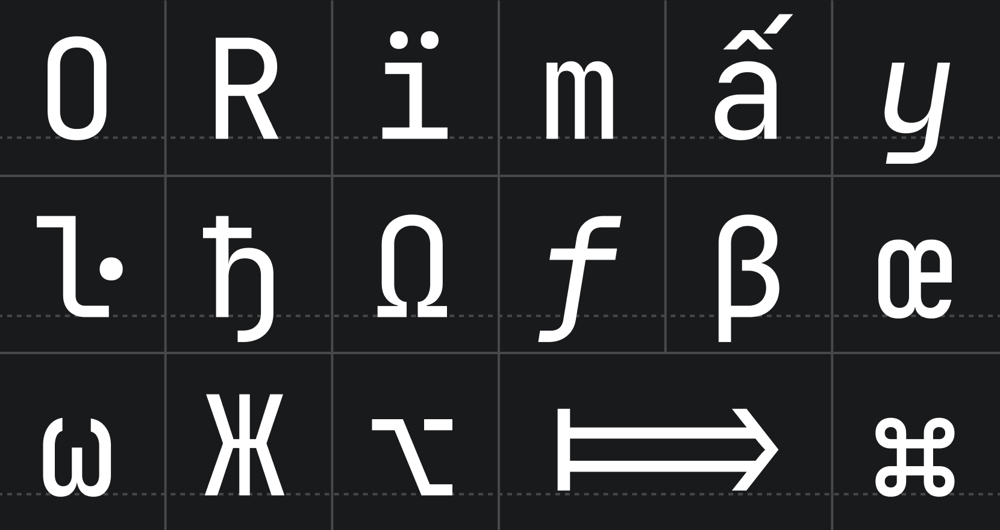
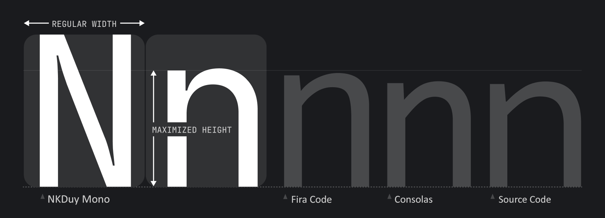
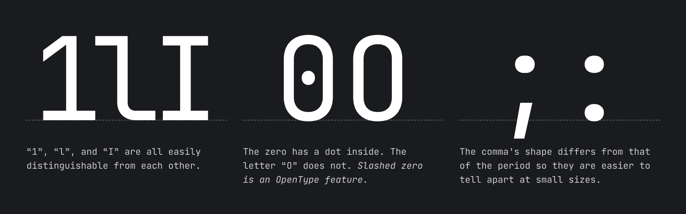
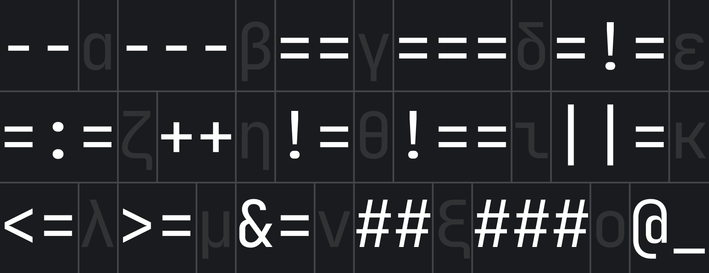
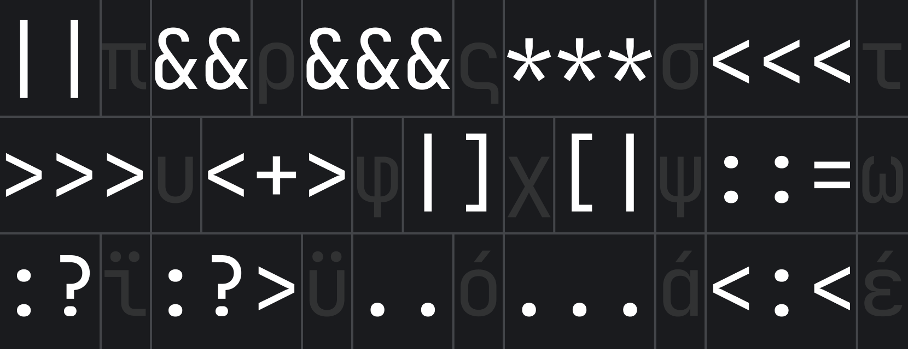
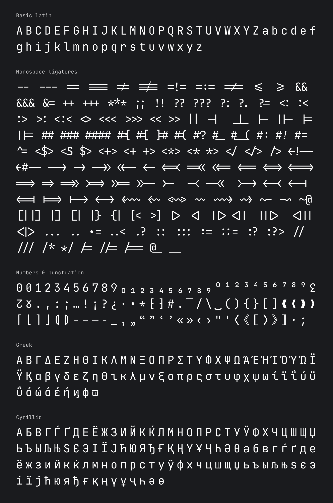

# NKDuy Mono: a typeface made for developers


Default version of NKDuy Mono comes with OpenType features and ligatures (which can always be toggled on & off in the settings).

# **Installation**

### Brew (macOS only)

1. Tap the font cask to make the NKDuy Mono font available :

    ```console
    brew tap homebrew/cask-fonts
    ```
2. Install it using the `font-nkduy-mono` cask:

   ```console
   brew install --cask font-nkduy-mono
   ```

### Manual installation

_On Mac/Windows_: 

1. [Download font](https://github.com/khanhduy1407/NKDuyMono/releases/latest). 
2. Unzip the archive and install the font:
   - _Mac_. Select all font files in the folder and double-click them. Click the **Install Font** button.
   - _Windows_. Select all font files in the folder, right-click any of them, then pick **Install** from the menu.

📝 Note: If you have previously installed NKDuy Mono, please uninstall all previous versions to exclude conflicts and errors in rendering.

_On Linux_: 

Open a terminal and run the following:

```bash
/bin/bash -c "$(curl -fsSL https://raw.githubusercontent.com/khanhduy1407/NKDuyMono/master/install_manual.sh)"
```

Once NKDuy Mono is installed in your OS, you are ready to configure the editor.  


### **Visual Studio Code** 

1. From the **File** menu (**Code** on Mac) go to `Preferences` → `Settings, or use keyboard shortcut <kbd>Ctrl</kbd>+<kbd>,</kbd> (<kbd>Cmd</kbd>+<kbd>,</kbd> on Mac).
2. In the E**ditor: Font Family** input box type `NKDuy Mono`, replacing any content.
3. To enable ligatures, go to **Editor: Font Ligatures**, click **Edit in settings.json**, and copy this line `"editor.fontLigatures": true` into json file.

## Font Styles
There are 8 font styles available in NKDuy Mono, from Thin to ExtraBold, each coming with its own _italic_ version.

## Font Features

### Increased x-height
While characters remain standard in width, the height of the lowercase is maximized. This approach keeps code lines to the length that developers expect, and it helps improve rendering in small size, since each symbol occupies more pixels.



### Distinctiveness of symbols



## Ligatures for Code
A ligature is a character consisting of two or more joined symbols. Traditionally, it was introduced as a space-saving technique in printed texts. In code, this technique is adopted to show operators and is used mainly for two purposes:
1. To **reduce noise** by merging symbols and removing details so the eyes are processing less:



2. To balance whitespace more efficiently by shifting the glyphs in certain cases:



📝 Note: if your IDE doesn’t support OpenType features and ligatures, use [NKDuy Mono NL](https://github.com/khanhduy1407/NKDuyMono/tree/master/fonts/ttf) instead.

## Basic Character Set



## License

The source code is available under [Apache 2.0 License](https://www.apache.org/licenses/LICENSE-2.0)
